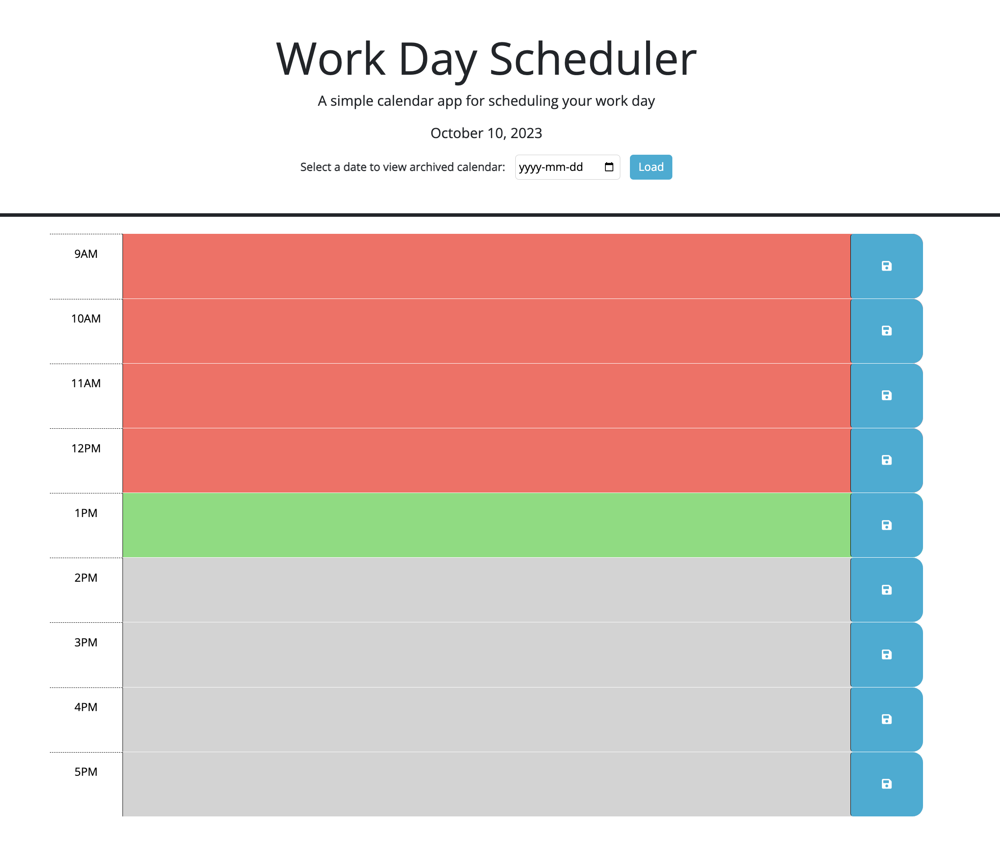

# Work Day Task Manager App

## Introduction 📚

The Work Day Task Manager is a web-based daily planner designed for business professionals. It allows users to allocate tasks from 9 a.m. to 5 p.m., with color-coded time blocks to indicate past, present, and future hours. Events are saved locally for persistence, and the app also offers an archival feature to revisit past schedules.

## Project Overview 🌐

The primary goal is to offer an intuitive platform for planning and accessing tasks for any workday, with additional features for event persistence and past schedule archival.

### Objectives 🎯

- Create a user-friendly interface.
- Implement event saving and color-coded time blocks.
- Enable schedule archival.

## Features 📝

- Plan tasks from 9 a.m. to 5 p.m.
- Color-coded time blocks
- Local storage for event persistence
- Archival functionality

## Development Process 💻

### Step 1: Requirement Analysis

User requirements include:
- Intuitive design.
- Event persistence.

### Step 2: Coding the Solution

Key functions include:

- **`displayCalendar`:** Generates the daily planner.
- **`saveEvent`:** Saves an event.
- **`loadArchive`:** Loads archived schedules.

### Step 3: Testing & Debugging

Robust testing ensures functionality and reliability, with debugging carried out for any identified issues.

## How to Use the APP 🖥️

1. **Clone the App**: Clone the app on your local machine.
1. **Open the App**: Simply open index.html in your web browser.
2. **Current Date**: The current date is displayed at the top.
3. **Time Blocks**: Scroll down to see time blocks from 9 a.m. to 5 p.m.
4. **Color Codes**:
    - **Green**: Current hour
    - **Gray**: Future hours
    - **Red**: Past hours
5. **Adding Events**: Click into a time block to add an event.
6. **Saving Events**: Click the save icon next to the time block to save your event.
7. **Archive**: Use the date picker to navigate to past or future dates and review or plan accordingly.

## Conclusion 🏁

The Work Day Scheduler app provides a straightforward platform for efficient workday planning. Feel free to explore and contribute to the codebase.

## Repository
[GitHub Repository](https://github.com/MrSep01/Work-Day-Task-Manager)

## APP Screenshot 🖼️

## Live Demo 🌐
A live demo of the project can be accessed [here](https://mrsep01.github.io/Work-Day-Task-Manager).

## License & Contribution 📜

Open for contributions and licensed under the MIT License.

## Contact 📞

For inquiries, please contact sep.alamouti@sepalamouti.com

# Work-Day-Task-Manager
The Work Day Scheduler is a web-based daily planner designed for business professionals. It allows users to allocate tasks from 9 a.m. to 5 p.m., with color-coded time blocks to indicate past, present, and future hours. Events are saved locally for persistence, and the app also offers an archival feature to revisit past schedules.

